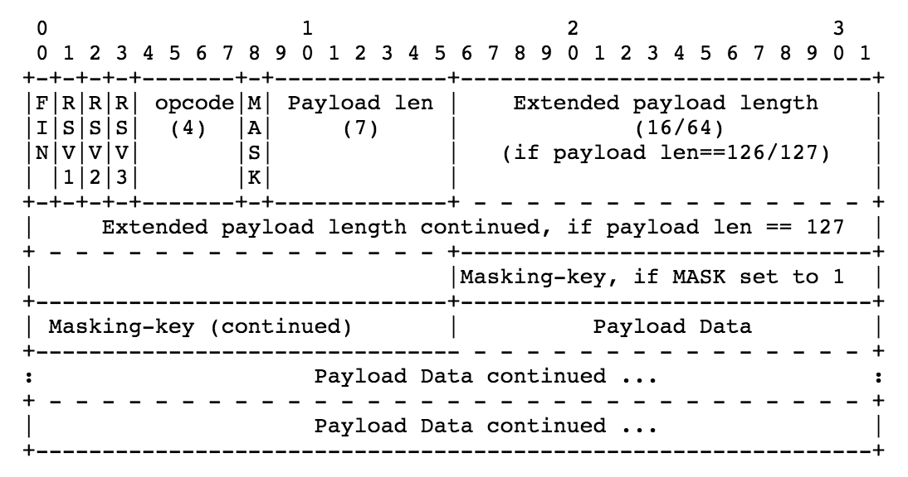

# MCWebSocket

[](https://travis-ci.org/MC-Studio/MCWebSocket)
[](http://cocoapods.org/pods/MCWebSocket)
[](http://cocoapods.org/pods/MCWebSocket)
[](http://cocoapods.org/pods/MCWebSocket)

## Example

To run the example project, clone the repo, and run `pod install` from the Example directory first.

## Requirements

## Installation

MCWebSocket is available through [CocoaPods](http://cocoapods.org). To install
it, simply add the following line to your Podfile:

```ruby
pod 'MCWebSocket'
```

## 实现步骤

### 一、认证握手

1、客户端发起连接请求

```html
GET ws://127.0.0.1:1688HTTP/1.1
Host: 127.0.0.1:1688
Connection: Upgrade
Upgrade: websocket
Sec-WebSocket-Version: 13
Sec-WebSocket-Key: 8nR/IHznszs77IXrvoSIKQ==
Sec-WebSocket-Extensions: permessage-deflate; client_max_window_bits
```

2、服务端响应（握手成功）可以开始通讯

```html
HTTP/1.1 101 WebSocket Protocol Handshake
Upgrade: websocket
Connection: Upgrade
Sec-WebSocket-Accept: DM03CzPOkPMsGtTWLXF8UGXURTU=
```

`Sec-WebSocket-Accept`就是把客户端上报的`Sec-WebSocket-Key`加上`258EAFA5-E914-47DA-95CA-C5AB0DC85B11`后做sha1计算，再base64之后返回给客户端。

### 二、数据传输
Websocket协议通过序列化的数据帧传输数据。数据封包协议中定义了opcode、payload length、Payload data等字段。

其中要求：

- 客户端向服务器传输的数据帧必须进行掩码处理：服务器若接收到未经过掩码处理的数据帧，则必须主动关闭连接。
- 服务器向客户端传输的数据帧一定不能进行掩码处理。客户端若接收到经过掩码处理的数据帧，则必须主动关闭连接。

针对上情况，发现错误的一方可向对方发送关闭帧（状态码是1002，表示协议错误），以关闭连接。

具体数据帧格式如下图：


主要用到位运算：亦或、逻辑与、逻辑或

## License

MCWebSocket is available under the MIT license. See the LICENSE file for more info.
